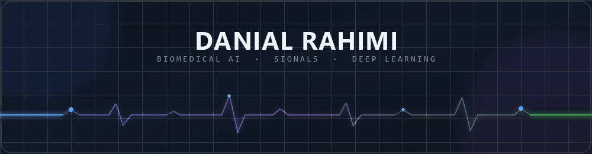

  

  
  

## Hello

I'm **Danial Rahimi**, an AI developer and researcher working in biomedical engineering, currently pursuing a BSc at **Amirkabir University of Technology**. Since 2021, I have developed and evaluated machine learning and deep learning systems for complex biomedical data, with an emphasis on rigorous experimentation, signal analysis, and research-driven implementation.

My work spans **deep learning, biomedical signal processing, computational neuroscience, and neuroscience-oriented AI**. I have experience with self-supervised learning, transformer-based models, retrieval-augmented generation (RAG) systems, spiking neural networks, hybrid architectures, transfer learning, and end-to-end research pipelines for varied biomedical and neural data.

Alongside this core focus, I work with React and frontend technologies on independent projects that combine technical implementation with interface design.

## Technical landscape

**AI, scientific computing, and biomedical signals**

  
  
  
  
  
  

  
  
  
  
  
  
  
  
  
  
  
  

**Frontend side quests**

  
  
  
  

## Let's connect

I'm open to thoughtful conversations, research collaboration, open-source work, and interesting engineering problems, especially where **AI meets biomedical data**.

  

Building models for signals that matter.

